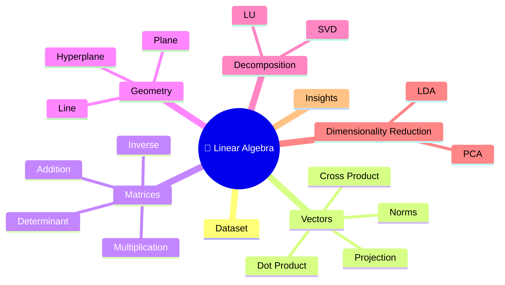
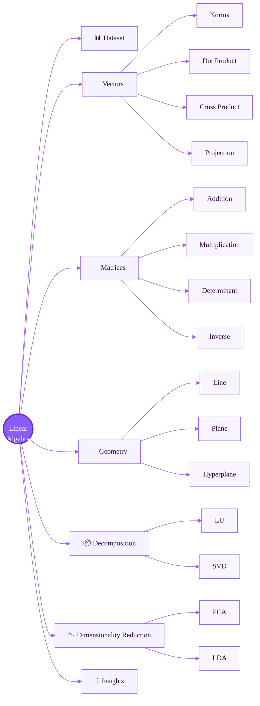

# 4️⃣ Mind Map

```mermaid
mindmap
  root((🧮 Linear Algebra))

    Dataset

    Vectors
      Norms
      Dot Product
      Cross Product
      Projection

    Matrices
      Addition
      Multiplication
      Determinant
      Inverse

    Geometry
      Line
      Plane
      Hyperplane

    Decomposition
      LU
      SVD

    Dimensionality Reduction
      PCA
      LDA

    Insights
```

---

```mermaid
%%{init:{
'theme':'base',
'themeVariables':{
'primaryColor':'#F8F5FF',
'primaryBorderColor':'#8B5CF6',
'primaryTextColor':'#3B0764',
'lineColor':'#A855F7',
'fontFamily':'Poppins'
}}}%%

flowchart LR

A(("🧮<br>Linear<br>Algebra"))

A --> B["📊 Dataset"]

A --> C["🔢 Vectors"]
C --> C1["Norms"]
C --> C2["Dot Product"]
C --> C3["Cross Product"]
C --> C4["Projection"]

A --> D["🧮 Matrices"]
D --> D1["Addition"]
D --> D2["Multiplication"]
D --> D3["Determinant"]
D --> D4["Inverse"]

A --> E["📐 Geometry"]
E --> E1["Line"]
E --> E2["Plane"]
E --> E3["Hyperplane"]

A --> F["📦 Decomposition"]
F --> F1["LU"]
F --> F2["SVD"]

A --> G["📉 Dimensionality Reduction"]
G --> G1["PCA"]
G --> G2["LDA"]

A --> H["💡 Insights"]

style A fill:#8B5CF6,color:#ffffff,stroke:#6D28D9,stroke-width:3px
style B fill:#F5F3FF,stroke:#8B5CF6
style C fill:#F5F3FF,stroke:#8B5CF6
style D fill:#F5F3FF,stroke:#8B5CF6
style E fill:#F5F3FF,stroke:#8B5CF6
style F fill:#F5F3FF,stroke:#8B5CF6
style G fill:#F5F3FF,stroke:#8B5CF6
style H fill:#F5F3FF,stroke:#8B5CF6
```
