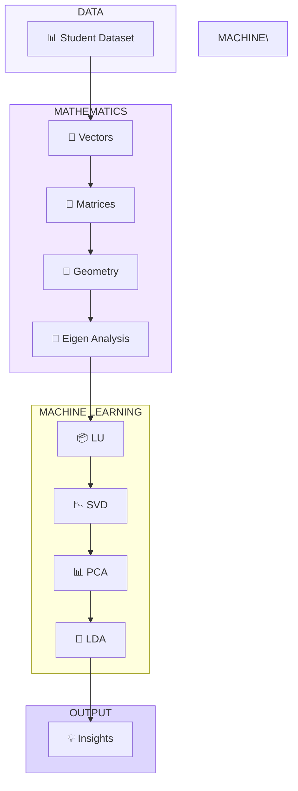
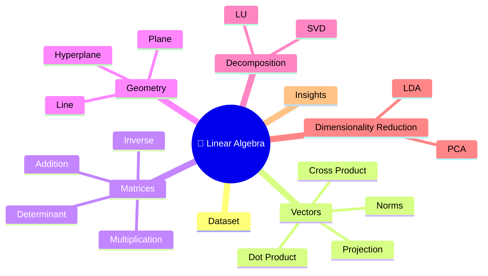
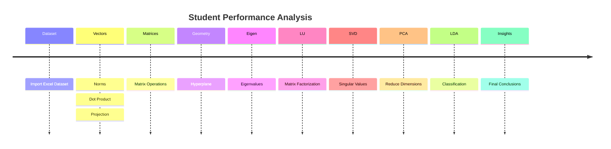
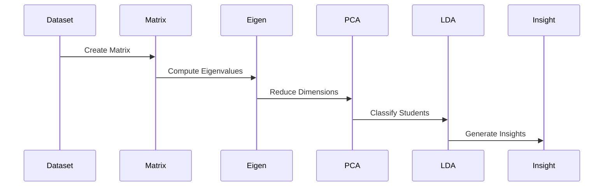
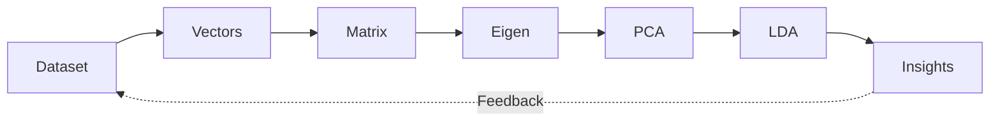
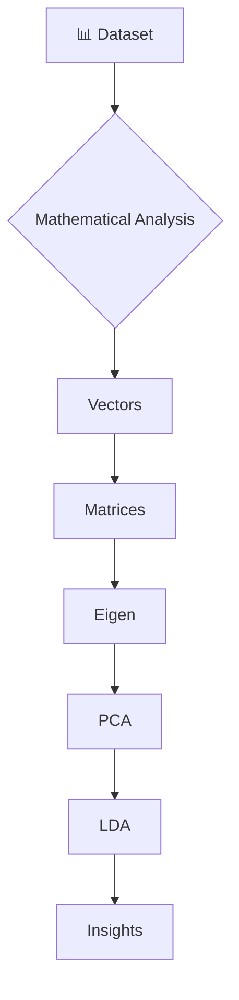
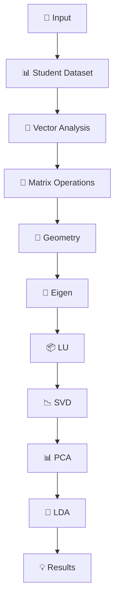

# 💜 Mermaid Showcase

---

# 1️⃣ Minimal Pipeline


---

# 2️⃣ Dashboard Architecture



---

# 3️⃣ Gradient Cards


---

# 4️⃣ Mind Map



---

# 5️⃣ Timeline



---

# 6️⃣ Sequence Diagram



---

# 7️⃣ Circular Workflow



---

# 8️⃣ Decision Flow



---

# 9️⃣ Research Pipeline



---

# 🔟 Metro Style

```mermaid
flowchart TB

A((Dataset))
|
B((Vectors))
|
C((Matrices))
|
D((Geometry))
|
E((Eigen))
|
F((LU))
|
G((SVD))
|
H((PCA))
|
I((LDA))
|
J((Insights))
```
