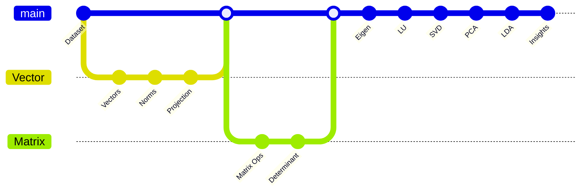
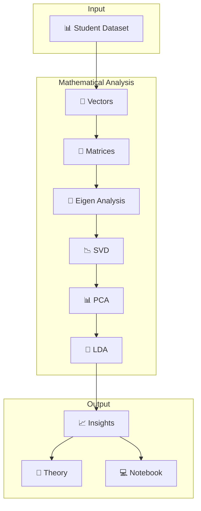

```mermaid
gitGraph

commit id:"Dataset"

branch Vector

checkout Vector

commit id:"Vectors"

commit id:"Norms"

commit id:"Projection"

checkout main

merge Vector

branch Matrix

checkout Matrix

commit id:"Matrix Ops"

commit id:"Determinant"

checkout main

merge Matrix

commit id:"Eigen"

commit id:"LU"

commit id:"SVD"

commit id:"PCA"

commit id:"LDA"

commit id:"Insights"
```

---

```mermaid
flowchart TB

subgraph Input
A[📊 Student Dataset]
end

subgraph Mathematical Analysis
B[🔢 Vectors]
C[🧮 Matrices]
D[🌟 Eigen Analysis]
E[📉 SVD]
F[📊 PCA]
G[🎯 LDA]
end

subgraph Output
H[📈 Insights]
I[📖 Theory]
J[💻 Notebook]
end

A --> B

B --> C

C --> D

D --> E

E --> F

F --> G

G --> H

H --> I

H --> J
```
