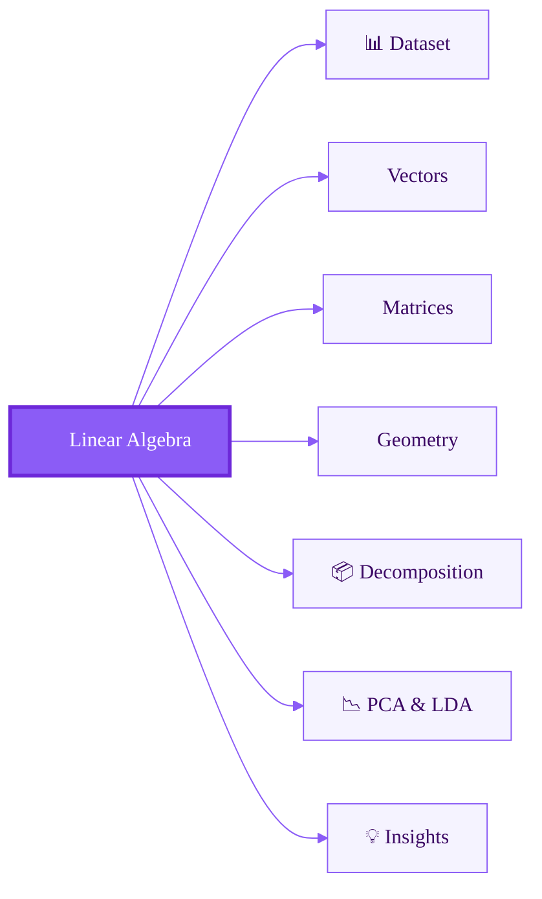

```mermaid
%%{init:{
'theme':'base',
'themeVariables':{
'primaryColor':'#F5F3FF',
'primaryBorderColor':'#8B5CF6',
'primaryTextColor':'#3B0764',
'lineColor':'#8B5CF6',
'fontFamily':'Poppins',
'fontSize':'16px'
}}}%%

flowchart LR

A["🧮 Linear Algebra"]

A --> B["📊 Dataset"]
A --> C["🔢 Vectors"]
A --> D["🧮 Matrices"]
A --> E["📐 Geometry"]
A --> F["📦 Decomposition"]
A --> G["📉 PCA & LDA"]
A --> H["💡 Insights"]

style A fill:#8B5CF6,color:#ffffff,stroke:#6D28D9,stroke-width:3px
style B fill:#F5F3FF,stroke:#8B5CF6,color:#3B0764
style C fill:#F5F3FF,stroke:#8B5CF6,color:#3B0764
style D fill:#F5F3FF,stroke:#8B5CF6,color:#3B0764
style E fill:#F5F3FF,stroke:#8B5CF6,color:#3B0764
style F fill:#F5F3FF,stroke:#8B5CF6,color:#3B0764
style G fill:#F5F3FF,stroke:#8B5CF6,color:#3B0764
style H fill:#F5F3FF,stroke:#8B5CF6,color:#3B0764
```
