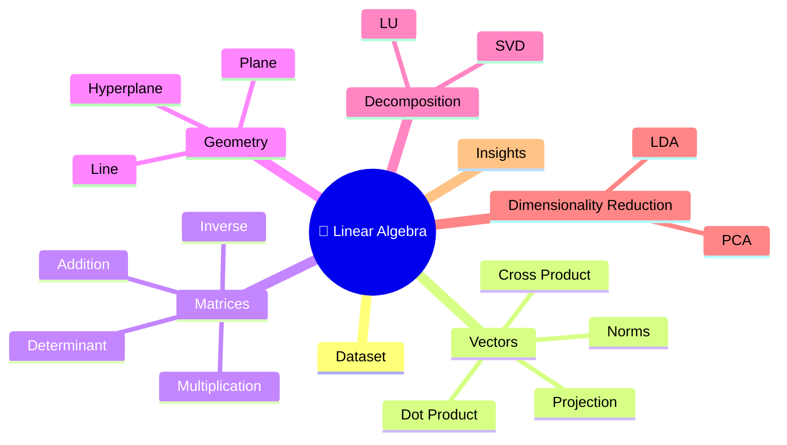

# 4️⃣ Mind Map

```mermaid
mindmap
  root((🧮 Linear Algebra))

    Dataset

    Vectors
      Norms
      Dot Product
      Cross Product
      Projection

    Matrices
      Addition
      Multiplication
      Determinant
      Inverse

    Geometry
      Line
      Plane
      Hyperplane

    Decomposition
      LU
      SVD

    Dimensionality Reduction
      PCA
      LDA

    Insights
```
