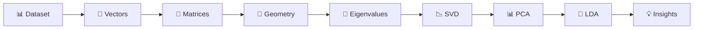

⬇️

⬇️

⬇️

⬇️

⬇️

⬇️

⬇️

➡️

➡️

➡️

➡️

➡️

➡️

➡️

➡️

➡️

➡️

➡️

➡️

➡️

```mermaid
flowchart LR
A[📊 Dataset] --> B[🔢 Vectors]
B --> C[🧮 Matrices]
C --> D[📐 Geometry]
D --> E[🌟 Eigenvalues]
E --> F[📉 SVD]
F --> G[📊 PCA]
G --> H[🎯 LDA]
H --> I[💡 Insights]
```
